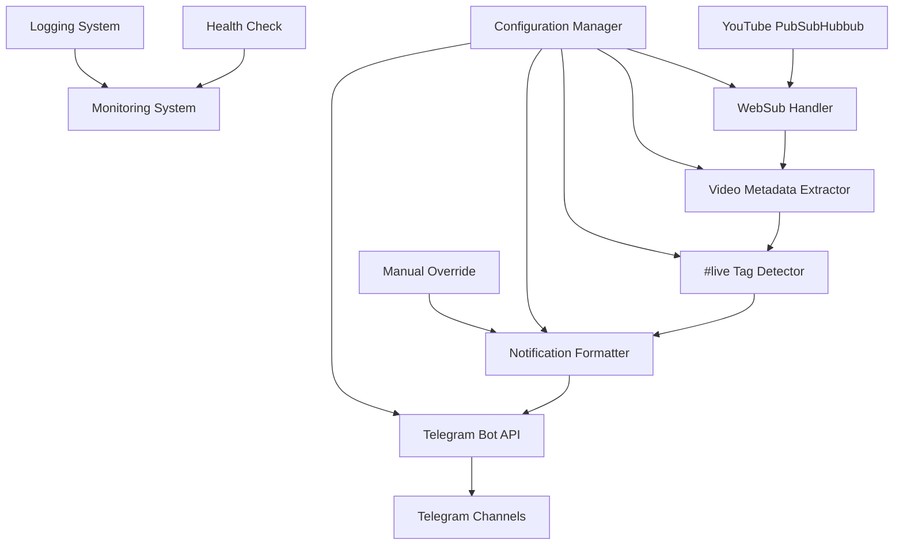

# YouTube Livestream Telegram Notification Bot Implementation Plan

## Overview
This document outlines the implementation plan for a YouTube livestream Telegram notification bot that monitors YouTube's PubSub notifications for video description updates, detects the "#live" tag, and sends notifications to Telegram channels.

## System Architecture

## Detailed Implementation Plan

### 1. Set up project structure and dependencies

- Create a well-organized project structure with clear separation of concerns
- Install necessary dependencies:
  - `grammy` or `node-telegram-bot-api` for Telegram bot integration
  - `express` or `hono` for HTTP server (WebSub callback endpoint)
  - `dotenv` for environment variables management
  - `winston` or `bunyan` for structured logging
  - `axios` or `undici` for HTTP requests
  - `zod` for configuration validation
- Update `package.json` with proper scripts and dependencies
- Set up TypeScript configuration for optimal development experience

### 2. Implement YouTube PubSubHubbub (WebSub) subscription handler

- Create an HTTP endpoint to handle WebSub callbacks from YouTube
- Implement subscription logic to register for YouTube channel updates
- Add verification for hub.challenge and hub.mode parameters
- Parse incoming XML/Atom feed data from YouTube notifications
- Extract video IDs and basic metadata from notifications
- Implement error handling for malformed requests

### 3. Create YouTube video metadata extraction service

- Implement a service to fetch detailed video metadata using YouTube Data API
- Extract video title, description, thumbnail URL, and other relevant information
- Handle API rate limits and quotas
- Cache metadata to reduce API calls
- Implement fallback mechanisms when API is unavailable

### 4. Implement "#live" tag detection logic

- Create a parser to scan video descriptions for the "#live" tag
- Implement case-insensitive matching
- Add support for variations like "#live" with additional text
- Create a filter to only process videos with the "#live" tag
- Log detection events for monitoring and debugging

### 5. Set up Telegram bot API integration

- Implement Telegram bot client using environment-provided token
- Create functions to send messages to multiple chat IDs
- Support rich message formatting (Markdown/HTML)
- Handle different message types (text, images, links)
- Implement error handling for API failures

### 6. Create notification message formatter with Turkish language support

- Design a template system for notification messages
- Include all required elements: headline, title, start time, platform links
- Format messages in Turkish language as specified
- Support rich formatting with emojis and links
- Create different message templates for different audiences if needed

### 7. Implement configuration management system

- Create a configuration system using environment variables
- Validate configuration using Zod schemas
- Support for multiple Telegram chat IDs
- Include platform links from environment variables
- Provide default values for optional settings
- Implement configuration reload without restart

### 8. Add error handling and retry mechanisms

- Implement exponential backoff for failed API requests
- Create a retry queue for failed Telegram notifications
- Add circuit breaker pattern for external API failures
- Implement graceful degradation when services are unavailable
- Add alerting for critical failures

### 9. Set up logging and monitoring system

- Implement structured logging with Winston or similar
- Log all important events: subscriptions, detections, notifications
- Include correlation IDs for tracking requests across services
- Add performance metrics logging
- Implement log rotation and retention policies

### 10. Create health check endpoint

- Implement a simple HTTP endpoint for health checks
- Check connectivity to external services (YouTube API, Telegram API)
- Provide status information about the application
- Include basic metrics in the response
- Support for monitoring tools like UptimeRobot

### 11. Implement manual override command (/notify)

- Create a Telegram bot command handler for manual notifications
- Allow authorized users to trigger notifications
- Include the latest livestream information in the manual notification
- Add permission checks to prevent abuse
- Log manual notification events

### 12. Add deduplication logic to prevent repeated notifications

- Implement a system to track already notified videos
- Use in-memory cache with TTL for recent videos
- Add persistent storage for longer-term tracking
- Prevent duplicate notifications for the same livestream
- Handle edge cases like video updates after going live

### 13. Set up environment variables and secrets management

- Define all required environment variables
- Create a .env.example file with documentation
- Implement validation for required variables
- Support for different environments (development, production)
- Document how to set up secrets in Coolify

### 14. Create deployment configuration for Coolify

- Create Dockerfile for containerization
- Set up Coolify deployment configuration
- Implement health checks for Coolify
- Configure environment variables in Coolify
- Set up automatic deployment from Git repository

### 15. Write documentation and operational procedures

- Create comprehensive README with setup instructions
- Document all configuration options
- Write operational procedures for maintenance
- Include troubleshooting guide
- Document API endpoints and their usage

## Environment Variables

The following environment variables will be used:

- `YOUTUBE_CHANNEL_ID`: The YouTube channel ID to monitor
- `TELEGRAM_BOT_TOKEN`: The Telegram bot token
- `TELEGRAM_CHAT_IDS`: Comma-separated list of Telegram chat IDs
- `YOUTUBE_API_KEY`: YouTube Data API key for metadata fetching
- `PLATFORM_LINKS`: JSON string with platform links
- `WEBHOOK_SECRET`: Secret for verifying WebSub callbacks
- `LOG_LEVEL`: Logging level (e.g., info, debug, error)
- `PORT`: Port for the HTTP server

## Success Metrics

The implementation will be measured against the success metrics defined in the PRD:

- **Detection latency:** 90% of livestreams announced within 60 seconds (stretch target: 30 seconds)
- **Delivery success:** 99% of intended Telegram channels/groups receive the notification without retries
- **Operational visibility:** Error alerts available to maintainers within 2 minutes of failure
- **Manual intervention rate:** Fewer than 5% of streams require manual re-sending

## Risks and Mitigations

1. **WebSub delivery delays/outages**
   - Mitigation: Implement fallback polling of YouTube Data API
   - Alerting: Notify maintainers when no callbacks arrive within expected windows

2. **Telegram delivery limits**
   - Mitigation: Batch messages or throttle sends if many destinations
   - Monitoring: Monitor for API errors and adjust sending rate

3. **Stream metadata changes close to start**
   - Mitigation: Refresh data immediately prior to send
   - Fallback: Support manual edits and resends

4. **Configuration drift**
   - Mitigation: Use environment variables and validation
   - Monitoring: Alert on configuration changes

5. **Missing `#live` tag**
   - Mitigation: Log skipped notifications for review
   - Process: Include manual checks in production playbook

## Timeline

Based on the milestones in the PRD:

1. **MVP (Week 1-2):** WebSub subscription + Telegram notification to single channel with static links
2. **Release Candidate (Week 3):** Multi-channel messaging, templated links, retries, manual override
3. **Production Launch (Week 4):** Logging, alerting hooks, documentation, deployment automation